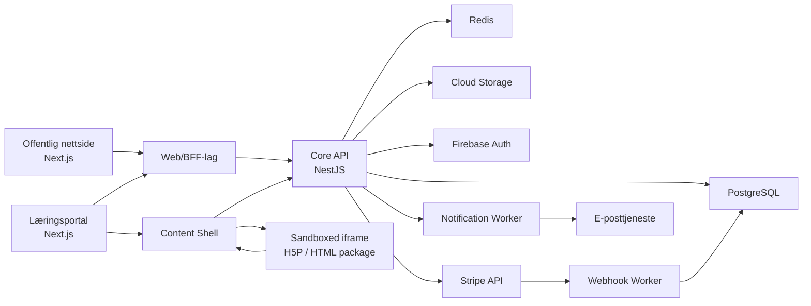

# LMS-plattform for salg og levering av norskkurs

Status: anbefalt løsningsspesifikasjon  
Dato: 16. mars 2026  
Mål: erstatte Moodle fullt ut for salg, levering og administrasjon av CEFR-baserte norskkurs

## 1. Konklusjon

Den anbefalte løsningen er en moderne LMS-plattform bygget som en modulær monolitt med tydelige domenemoduler, ikke et plugin-basert system. Den skal kombinere:

- offentlig nettside og kjøpsflyt
- innlogget læringsportal
- administrasjon av kurs, brukere, vurdering og meldinger
- sikker visning av H5P og opplastede HTML/CSS/JS-pakker

Anbefalt arkitektur:

- `Next.js` for offentlig side og innlogget webklient
- `TypeScript` i hele stacken
- `NestJS` eller tilsvarende modulær Node-backend for domenelogikk
- `PostgreSQL` som primærdatabase
- `Redis` for cache, rate limiting og køstøtte
- `Google Cloud Run` for API, worker og bakgrunnsjobber
- `Cloud SQL for PostgreSQL` for transaksjonelle data
- `Cloud Storage` for filer, H5P, videoer og innholdspakker
- `Firebase Authentication` for sikker autentisering og sesjonshåndtering
- `Stripe Checkout + webhooks` for kjøp og automatisk tilgang

Firebase bør brukes selektivt, ikke som hoveddatabase. For denne domeneformen er PostgreSQL bedre egnet enn Firestore fordi løsningen har mange relasjonelle behov:

- kjøp, ordre og entitlements
- kurs, pakker og tilgangsregler
- progresjon, forsøk og karakterbok
- meldingsbokser, saksflyt og ansvar
- rettighetsstyring og revisjonsspor

## 2. Mål og avgrensning

### Mål

Plattformen skal:

- erstatte Moodle fullt ut
- selge CEFR-baserte kurs og pakker
- gi automatisk tilgang ved kjøp
- støtte tusenvis av samtidige brukere
- være mobilvennlig og flerspråklig
- være sikker, reviserbar og GDPR-tilpasset

### Bevisst avgrensning

Plattformen skal ikke:

- bygge en full WYSIWYG-kursbygger
- støtte vilkårlig server-side kode i opplastet innhold
- støtte PHP i innholdspakker
- prioritere avansert livechat i første fase
- prioritere kompleks flerorganisasjonslogikk i MVP hvis kunden kun driver én virksomhet

## 3. Anbefalt produktmodell

### Kjerneobjekter

- `Level`: CEFR-nivå som A1, A2, B1, B2, C1
- `Course`: konkret kurs innen et nivå
- `Package`: salgbar enhet, for eksempel `B1-pakke`, `B1+B2-pakke`, `Prøveperiode B1`
- `Module`: faglig gruppe med aktiviteter
- `Activity`: læringsobjekt, for eksempel video, H5P, quiz, manuell innlevering eller ekstern HTML-pakke
- `Entitlement`: faktisk tilgang en bruker har til et kurs, nivå eller en pakke
- `Attempt`: ett forsøk på en aktivitet
- `GradeItem`: vurderbar enhet i karakterbok
- `Conversation` og `Ticket`: meldings- og saksobjekter

### Salgbare enheter

Plattformen bør skille tydelig mellom:

- fagstruktur: nivåer, kurs, moduler og aktiviteter
- salgstruktur: produkter og pakker

Dette gjør det mulig å:

- selge samme kurs i flere pakkekombinasjoner
- endre pris uten å endre kursstruktur
- aktivere flere pakker samtidig for samme bruker

## 4. Anbefalt tech stack

| Lag | Anbefaling | Begrunnelse |
|---|---|---|
| Frontend | Next.js + React + TypeScript | Rask SSR/ISR for offentlig side, god appstruktur for portal |
| UI | Designsystem med Radix UI/Headless UI + Tailwind/CSS tokens | Gir tilgjengelig, responsiv og konsistent UI |
| I18n | `next-intl` eller tilsvarende | Egnet for flerspråklig UI med separate locale-filer |
| Backend API | NestJS + TypeScript | Tydelig modulstruktur, guards, DTO-er, testbarhet |
| Database | PostgreSQL | Best for relasjoner, transaksjoner, rapportering og konsistens |
| ORM | Prisma eller Drizzle | God TypeScript-støtte, migrasjoner og datamodellering |
| Cache/kø | Redis | Rate limits, kortlevd state, idempotency lock, køhjelp |
| Filer | Google Cloud Storage | Sikker filhåndtering, signerte URL-er, CDN-vennlig |
| Hosting | Cloud Run | Enkel drift, autoskalering og tydelig tjenesteisolasjon |
| Auth | Firebase Authentication | Stabil identitetshåndtering, e-postlenker, passordreset, claims |
| Sessjoner | Firebase session cookies + backend session policy | Sikker serverstyrt innlogging i webapp |
| Betaling | Stripe Checkout + webhook-prosessering | Robust kjøpsflyt og automatisk aktivering |
| E-post | Transaksjonell e-posttjeneste via backend | Velkomst, kvittering, melding- og statusvarsler |
| Observability | OpenTelemetry + strukturert logging + feilsporing | Revisjon, feilsøking og driftskontroll |

### Hvorfor ikke ren Firebase-stack

En ren Firebase-stack med Firestore som hoveddatabase er ikke førstevalg fordi:

- karakterbok og progresjon krever mange relasjonelle oppslag
- entitlements, pakker og kjøpsregler er enklere og tryggere i SQL
- meldingsflyt med `jeg tar denne`, statuser og ansvar passer bedre i relasjonell modell
- rapportering og revisjon blir enklere i PostgreSQL

Firebase passer likevel godt til:

- autentisering
- App Check
- eventuelt push-varsler senere
- sikker client identity mot backend

## 5. Arkitektur

### Arkitekturprinsipp

Start med en modulær monolitt, ikke mikroservices. Det gir:

- lavere kompleksitet
- enklere transaksjoner
- raskere leveranse
- enklere feilsøking

Moduler skal ha klare grenser slik at deler senere kan trekkes ut til egne tjenester ved behov.

### Hovedkomponenter



### Logisk oppdeling

- `web`: offentlig side, kurskatalog, checkout-initiering, SEO-sider
- `portal`: dashboard, læringsflater, meldinger, karakterbok
- `api`: domener og forretningslogikk
- `worker`: webhook-prosessering, e-post, sertifikatgenerering, bakgrunnsjobber
- `content-shell`: sikker innholdsramme rundt H5P og HTML-pakker

### Domenemoduler i backend

- `identity`
- `users`
- `catalog`
- `commerce`
- `entitlements`
- `content`
- `learning`
- `assessment`
- `gradebook`
- `certificates`
- `messaging`
- `support`
- `notifications`
- `admin`
- `audit`
- `privacy`

## 6. Rolle- og tilgangsmodell

Bruk RBAC med scoped autorisasjon.

### Roller

- `student`
- `teacher`
- `support`
- `admin`

### Autorisasjonsmodell

Rolle alene er ikke nok. Tilgang må kombineres med scope:

- kurs
- nivå
- pakke
- gruppe
- ticket queue

Eksempler:

- en lærer kan ha tilgang til `B1` og `B2`, men ikke `A2`
- support kan se supportsaker, men ikke karakterdetaljer uten eksplisitt rettighet
- admin kan administrere katalog og brukere, men alle sensitive handlinger skal logges

### Eksempel på rettighetsmatrise

| Handling | Student | Lærer | Support | Admin |
|---|---|---|---|---|
| Se egne kurs | Ja | Nei | Nei | Ja |
| Se studentresultater | Egen | Scoped, unntatt skjulte | Nei | Ja |
| Rette læreroppgaver | Nei | Scoped | Nei | Ja |
| Håndtere supportticket | Nei | Nei | Ja | Ja |
| Administrere kursstruktur | Nei | Begrenset ved behov | Nei | Ja |
| Administrere pakker og priser | Nei | Nei | Nei | Ja |
| Se API-nøkler | Nei | Nei | Nei | Kun via sikre backend-rutiner |

### Tekniske mekanismer

- Firebase Auth for identitet
- session cookie for web
- custom claims kun for grove roller
- finmaskede tillatelser lagres i PostgreSQL
- backend policy-layer validerer både rolle og scope
- alle admin- og supporthandlinger logges i `audit_log`

## 7. Datamodell på høyt nivå

### Identitet og brukere

- `users`
- `user_profiles`
- `user_auth_identities`
- `role_assignments`
- `teacher_course_scopes`
- `support_queue_scopes`
- `consents`
- `deletion_requests`

### Katalog og innhold

- `levels`
- `courses`
- `course_translations`
- `packages`
- `package_items`
- `modules`
- `activities`
- `activity_rules`
- `content_packages`
- `content_package_versions`
- `media_assets`
- `certificate_templates`
- `badge_definitions`

### Commerce og tilgang

- `products`
- `product_prices`
- `orders`
- `order_items`
- `payments`
- `stripe_customers`
- `checkout_sessions`
- `entitlements`
- `trial_redemptions`

### Læring og vurdering

- `enrollments`
- `attempts`
- `attempt_events`
- `submissions`
- `manual_reviews`
- `grade_items`
- `gradebook_entries`
- `module_progress`
- `course_progress`
- `badge_awards`
- `certificate_issues`

### Meldinger og support

- `conversations`
- `conversation_participants`
- `messages`
- `message_attachments`
- `queues`
- `tickets`
- `ticket_events`
- `ticket_assignments`

### Drift og revisjon

- `notifications`
- `email_deliveries`
- `webhook_events`
- `idempotency_keys`
- `audit_log`
- `security_events`

### Viktige modellvalg

- Bruk `JSONB` for fleksible regler, ikke for kjerneforhold
- Skill `attempts` fra `gradebook_entries`
- Skill `packages` fra `courses`
- Behandle meldinger og tickets som beslektede, men ikke identiske objekter

## 8. Modell for Stripe-kjøp og automatisk kursaktivering

### Mål

Kjøp skal gi automatisk kontoopprettelse eller kobling, og automatisk tilgang uten manuell admin-håndtering.

### Anbefalt kjøpsflyt

1. Bruker velger kurs eller pakke på offentlig side.
2. Frontend kaller backend for å opprette Stripe Checkout Session.
3. Backend lagrer en `checkout_session` med:
   - valgt produkt
   - valgt pris
   - forventet entitlement-type
   - e-post
   - locale
   - eventuell trial-konverteringskontekst
4. Backend oppretter Stripe Checkout Session med metadata:
   - `product_id`
   - `package_id`
   - `price_id`
   - `source`
5. Bruker fullfører betaling i Stripe.
6. Stripe sender webhook til backend-worker.
7. Worker verifiserer signatur, lagrer rå event og kjører idempotent prosessering.
8. Worker finner eller oppretter bruker basert på normalisert e-post.
9. Worker oppretter ordre, betaling og entitlement.
10. Systemet sender velkomst- eller innloggingsmail.

### Viktige regler

- Ikke aktiver tilgang basert på redirect til `success_url`
- Kun verifisert webhook skal gi tilgang
- Bruk idempotency for å tåle duplikate webhook-kall
- Kjøp og entitlement-opprettelse skal være transaksjonell

### Kontoopprettelse og kobling

Normalisert e-post brukes som nøkkel:

- trim
- lowercase
- Unicode-normalisering

Flyt:

- Hvis bruker finnes: kjøpet kobles til eksisterende konto
- Hvis bruker ikke finnes: konto opprettes i `pending activation`-modus
- Bruker mottar magisk aktiveringslenke eller passordoppsett

### Entitlement-modell

En `entitlement` bør inneholde:

- `user_id`
- `source_type`: `purchase`, `trial`, `admin_grant`
- `source_id`
- `access_scope_type`: `package`, `course`, `level`
- `access_scope_id`
- `starts_at`
- `ends_at`
- `certificate_enabled`
- `teacher_help_enabled`
- `status`

### Flere pakker samtidig

Ikke bruk kun én aktiv enrollment per bruker. Systemet må støtte flere samtidige entitlements og aggregere disse til en samlet portalvisning.

## 9. Modell for trial per nivå

### Forretningsregler

- trial gis per nivå
- samme e-post kan bare få trial én gang per nivå
- trial gir full kursadgang i et fast antall dager
- trial gir ikke lærerhjelp
- trial gir ikke kursbevis
- trial kan konverteres til betalt tilgang

### Teknisk modell

Bruk tabellen `trial_redemptions`:

- `level_id`
- `normalized_email_hash`
- `user_id` nullable
- `trial_started_at`
- `trial_expires_at`
- `converted_order_id` nullable
- `status`

Legg unik indeks på:

- `level_id`
- `normalized_email_hash`

### Hvorfor hash og ikke klartekst

For å redusere personvernrisiko bør systemet lagre en deterministisk HMAC-hash av normalisert e-post for trial-kontroll, ikke klartekst i denne tabellen. Det gjør det mulig å:

- håndheve én trial per nivå
- redusere eksponering av persondata
- beholde et minimumsspor for antifraud selv om brukerprofil senere slettes

### Trial-aktivering

1. Bruker ber om trial på nivåside.
2. Backend normaliserer e-post og beregner hash.
3. Backend sjekker unikhet på `level_id + hash`.
4. Hvis ikke brukt: opprett trial entitlement med:
   - `teacher_help_enabled = false`
   - `certificate_enabled = false`
   - `ends_at = now + trial_days`
5. Hvis bruker senere kjøper nivået, markeres trial som `converted`.

### Viktig GDPR-vurdering

Ved selvbetjent sletting bør systemet fjerne konto- og læringsdata, men kunne beholde et minimalt, sterkt begrenset suppression-spor for:

- lovpålagt økonomidokumentasjon
- antifraud og trial-misbruk

Dette må beskrives eksplisitt i personvernteksten og vurderes juridisk før produksjon.

## 10. Innholdsmodell: H5P og HTML/CSS/JS-pakker

### Prinsipp

Plattformen skal ikke la opplastet innhold kjøre med samme tillit som LMS-frontenden. Alt eksternt innhold skal rendres isolert.

### Felles modell for opplasting

Alt opplastet læringsinnhold versjoneres som `content_package_version` med:

- type: `h5p`, `html_package`, `video`, `document`
- manifest
- checksum
- filstørrelse
- sikkerhetsskanningstatus
- publiseringsstatus
- referanse til storage-objekter

### Opplastingspipeline

1. Admin laster opp fil eller zip.
2. Backend lagrer i karantenebucket.
3. Worker validerer filtype, struktur og manifest.
4. Worker kjører sikkerhetsskanning:
   - blokker `.php`, `.exe`, shell-script og andre kjørbare filer
   - blokker uønskede HTML-tag/attributt-mønstre i første versjon
   - blokker service worker-registrering
   - blokker eksterne nettverkskall utover godkjente domener hvis policy krever det
5. Godkjent pakke flyttes til publiseringsbucket og får versjons-ID.

### H5P

H5P bør støttes som egen innholdstype med:

- opplasting av `.h5p`
- pakkeutpakking og lagring av assets
- avspilling i standard aktivitetsvisning
- innsamling av relevante resultat- og fullføringseventer

Anbefalt strategi:

- bygg en egen H5P-wrapper i content-shell
- bruk H5P sine klienteventer/xAPI der de finnes
- normaliser resultatene til plattformens forsøk- og progresjonsmodell

### HTML/CSS/JS-pakker

Disse bør pakkes som zip med minimum:

- `manifest.json`
- én definert `entry.html`
- lokale assets

Eksempel på manifest:

```json
{
  "name": "B1 Listening Drill 01",
  "version": "1.0.0",
  "entry": "index.html",
  "capabilities": ["progress", "score", "pass_fail"],
  "resultSchema": {
    "score": "number",
    "maxScore": "number",
    "passed": "boolean",
    "completed": "boolean"
  }
}
```

### Standardisert aktivitetsvisning

Alle aktiviteter skal vises i en standard shell med:

- toppbanner
- tittel
- beskrivelse
- læringsmetadata
- responsiv innholdscontainer
- statuslinje for progresjon og forsøk

Selve læringsobjektet vises i en iframe inne i denne shellen.

## 11. Sikker rendering av opplastede pakker

### Grunnregel

Opplastet innhold skal kjøres på eget origin, for eksempel `content.example.no`, ikke samme origin som portalen.

### Iframe-policy

Anbefalt iframe-oppsett:

- separat origin
- `sandbox` med minste nødvendige rettigheter
- streng `Content-Security-Policy`
- ingen tilgang til cookies for hovedapplikasjonen
- ingen direkte tilgang til interne API-nøkler eller brukerdata

### Tilgangsmønster

Frontend gjør dette:

1. Ber backend om å starte en `content_session`.
2. Backend validerer entitlement og oppretter en kortlivet sesjon med scope:
   - `user_id`
   - `activity_id`
   - `attempt_id`
   - tillatte handlinger
   - utløpstid
3. Content shell laster iframe.
4. Parent sender init-melding til iframe via `postMessage`.
5. Iframe sender kun strukturerte hendelser tilbake til parent.
6. Parent validerer hendelsen og sender den videre til backend.

Dette er tryggere enn å gi pakken direkte API-token med brede rettigheter.

## 12. Kontrakt mellom HTML/JS-pakke og LMS

### Prinsipp

Pakken skal ikke få generisk API-tilgang. Den skal kun få en liten, eksplisitt kontrakt.

### Hendelsesbasert kontrakt

Pakken kommuniserer med parent via `postMessage` med en versjonert protokoll.

Eksempler på meldinger fra pakke:

```json
{ "type": "lms.ready" }
{ "type": "lms.progress", "progress": 45 }
{ "type": "lms.score", "score": 8, "maxScore": 10 }
{ "type": "lms.pass_fail", "passed": true }
{ "type": "lms.complete", "completed": true }
{ "type": "lms.submit", "payload": { "answers": ["A", "C"] } }
```

Eksempler på meldinger fra LMS til pakke:

```json
{
  "type": "lms.init",
  "protocolVersion": 1,
  "activity": {
    "id": "act_123",
    "locale": "nb",
    "attemptNumber": 2
  },
  "permissions": {
    "canSubmit": true,
    "canStoreProgress": true
  }
}
```

### Backend-endepunkter

Parent shell eller egen SDK kan skrive til disse scoped endepunktene:

- `POST /content-sessions/:id/progress`
- `POST /content-sessions/:id/score`
- `POST /content-sessions/:id/submit`
- `POST /content-sessions/:id/complete`

### Validering

Backend må validere:

- at content session ikke er utløpt
- at session er knyttet til korrekt bruker og aktivitet
- at felter følger aktivitetens `resultSchema`
- at score og status er innenfor definerte grenser

### API-nøkler og AI-funksjoner

Hvis en pakke trenger backend-funksjoner, skal den ikke få rå nøkler. Den skal bare kunne kalle:

- en backend-proxy med allowlist
- en domenehandling som backend utfører på vegne av pakken

Eksempel:

- pakken ber om `tool.invoke: translate-feedback`
- backend sjekker at aktiviteten har lov til å bruke denne funksjonen
- backend bruker hemmelig API-nøkkel fra Secret Manager
- pakken får kun resultatet tilbake

## 13. Modell for progresjon, vurdering og fullføring

### Aktivitetsnivå

Hver aktivitet bør ha:

- `activity_type`
- `grading_mode`: `automatic`, `manual`, `mixed`, `practice_only`
- `attempt_policy`: `unlimited`, `limited`
- `grading_strategy`: `highest`, `latest`, `first_passing`
- `hide_from_teacher_allowed`
- `completion_rule`

### Automatisk vurderte aktiviteter

Støtt regler som:

- bestått hvis score >= terskel
- bestått hvis respons returnerer `passed=true`
- fullført hvis aktivitet sender `completed=true`

Dette lagres som konfigurerbare regler i `activity_rules`.

### Lærerrettede aktiviteter

For lærerrettede aktiviteter:

- student sender innlevering
- systemet oppretter `submission`
- lærer ser oppgaven i rettingskø
- lærer kan sette:
  - karakter `1-6`
  - `godkjent/ikke godkjent`
  - kommentar
- vurdering oppdaterer gradebook og fullføringsstatus

### Skjul resultat for lærer

Anbefalt modell:

- funksjonen er kun tilgjengelig for aktiviteter konfigurert med `hide_from_teacher_allowed = true`
- studenten velger synlighet per forsøk
- skjulte forsøk:
  - vises for studenten
  - kan telle i studentens egen øvingsprogresjon
  - vises ikke med detaljscore til lærer
  - skal ikke havne i lærerens rettingskø

For aktiviteter som inngår i formell læreroppfølging bør denne funksjonen være avslått.

### Modul fullført

En modul regnes som fullført når alle aktiviteter markert som `required_for_completion` er bestått eller fullført etter sine regler.

### Kurs fullført

Et kurs regnes som fullført når:

- alle obligatoriske moduler er fullført
- eventuelle obligatoriske manuelle vurderinger er behandlet
- eventuelle minimumskrav for kursbevis er oppfylt

## 14. Modell for karakterbok

### Prinsipp

Karakterbok skal være en avledet visning av forsøk, vurderinger og regler, ikke det primære sannhetslaget for rå data.

### Dataflyt

- `attempts` lagrer rå forsøk og autoresultater
- `manual_reviews` lagrer lærerbeslutninger
- `gradebook_entries` lagrer normaliserte visningsverdier

### Støttede visninger

- poengsum
- prosent
- karakter `1-6`
- bestått / ikke bestått
- siste forsøk
- beste forsøk

### Synlighet

- studenten ser alle egne resultater
- læreren ser scoped resultater som ikke er skjult
- support ser normalt ikke karakterdata

### Viktig implementasjonsvalg

Regn gradebook asynkront ved hendelser:

- nytt forsøk
- lærerretting
- regelendring

Dette gjør portalen raskere enn å recompute alt ved hver sidevisning.

## 15. Modell for badges og kursbevis

### Badges

Badges bør være regelstyrte og kunne trigges av:

- fullført modul
- fullført kurs
- score over terskel
- første fullføring av valgt aktivitetstype

Ved oppnådd badge:

- opprett `badge_award`
- vis badge i studentdashboard
- send valgfri e-post

### Kursbevis

Kursbevis bør genereres server-side fra mal:

- HTML-mal eller PDF-mal
- navn flettes inn i `til`-feltet
- eksisterende signatur ligger i template
- utstedt dokument lagres som immutable fil

Trial-entitlements skal ha `certificate_enabled = false`, og backend må håndheve dette ved utstedelse.

## 16. Meldingssystem, supportflyt og "jeg tar denne"

### Produktvalg

Bygg meldinger som asynkron intern meldingsboks, ikke chat.

### Objekter

- `conversation`: dialog mellom parter
- `message`: enkeltmelding
- `ticket`: saksobjekt for købasert håndtering
- `queue`: lærerteam eller supportteam
- `ticket_assignment`: hvem som har tatt saken

### Støttede flyter

- student til lærer 1-til-1
- lærer til student 1-til-1
- student til support
- lærer/admin til grupper basert på kurs eller nivå
- meldinger til alle lærere i et nivå eller kurs via queue

### "Jeg tar denne"

`jeg tar denne` bør implementeres som atomisk assignment:

1. Lærer eller support trykker `Ta sak`
2. Backend forsøker å sette `assignee_user_id`
3. Oppdatering lykkes bare hvis ticket er uten ansvarlig eller systemet tillater overtakelse med egen rettighet
4. Systemet logger hendelsen

Bruk optimistisk locking eller transaksjon med radlås for å unngå dobbeltansvar.

### Ticket-status

Minste sett:

- `new`
- `in_progress`
- `waiting_for_user`
- `being_fixed`
- `resolved`
- `closed`

### Gruppeutsendelser

Ikke kopier samme tekst blindt til tusen individuelle tråder i første versjon. Bruk:

- `announcement_campaign`
- målgruppefiltre
- individuelle leveringsrader for lesestatus hvis nødvendig

## 17. Dashboards

### Studentdashboard

Bør vise:

- aktive kurs og pakker
- nivåprogresjon
- fortsett der du slapp
- karakterbok
- badges
- kursbevis
- meldinger
- konto og personvern

Mobilprioritet:

- ett hovedkort per kurs
- tydelig `Fortsett`
- forenklet progresjonsbar
- meldinger og karakterbok i egne faner

### Lærerdashboard

Bør vise:

- egne kurs og nivåer
- rettingskø
- nye elevhenvendelser
- oversikt over studenter i scope
- skjulte resultater markert som utilgjengelige, ikke som feil

### Supportdashboard

Bør vise:

- felles innboks
- ticket-status
- `jeg tar denne`
- filtrering på prioritet, status og produkt

### Admindashboard

Bør vise:

- kurs- og pakkekatalog
- opplastede innholdspakker
- publiseringsstatus
- brukere og roller
- helseindikatorer
- webhook-feil
- innholdsfeil
- audit og personvernhendelser

## 18. Flerspråklig UI

### Anbefaling

Hold språkdeling i tre lag:

- system-UI: oversettes med locale-filer
- innholdsmetadata: oversettes per kurs/modul/aktivitet
- læringsinnhold: håndteres separat av innholdsprodusent

### Regler

- lagre brukerens foretrukne språk i profil
- la offentlig side og portal støtte locale i URL eller session
- ikke gjør supportflyt flerspråklig som krav i MVP

## 19. GDPR, sikkerhet og databehandling

### Sikkerhetsmål

Systemet skal bygges med:

- minst mulig privilegier
- tydelig rettighetsmodell
- kryptering i transitt og i ro
- revisjonsspor for sensitive handlinger
- kontrollert dataeksport og sletting

### Konkrete sikkerhetstiltak

- HTTPS overalt
- HSTS og moderne sikkerhetsheadere
- CSP for portal og innholdsdomene
- HttpOnly session cookies
- CSRF-beskyttelse for tilstandsendrede kall
- rate limiting på auth, trial og meldinger
- audit logging for admin, support og rettingshandlinger
- secrets i Secret Manager, aldri i frontend
- miljøseparasjon mellom dev, staging og prod
- database-backuper og restore-øvelser

### Firebase-bruk satt opp sikkert

Hvis Firebase brukes:

- bruk Firebase Auth som identitetsleverandør
- bruk session cookies server-side for web
- bruk custom claims kun til grove roller
- ikke legg sensitiv domeneautorisasjon i klienten
- bruk App Check for å redusere misbruk av offentlige klient-endepunkter
- bruk Storage bare med private buckets og signerte URL-er eller backend-gated tilgang

### GDPR-operasjonalisering

Systemet bør støtte:

- samtykke til vilkår og databehandling ved første bruk
- reviserbar lagring av samtykkeversjon
- selvbetjent sletting av konto
- eksport av brukerdata i fase 2 eller 3
- begrenset datatilgang etter rolle og arbeidsbehov

### Selvbetjent sletting

Anbefalt flyt:

1. Bruker ber om sletting fra profilside.
2. Systemet krever reautentisering.
3. Konto settes i `pending deletion`.
4. Worker kjører sletteløp:
   - anonymiser profil
   - slett meldingsvedlegg og personlige filer
   - fjern aktive sessioner
   - trekk tilbake entitlements
   - fjern eller anonymiser læringsdata der det er lovlig
5. Behold kun minimumsdata som må lagres av lov- eller antifraud-hensyn.

### Juridisk viktig presisering

Løsningen kan være GDPR-tilpasset, men endelig retention-policy for:

- regnskapsdata
- fakturaer
- antifraud-suppressionspor
- supporthistorikk

bør kvalitetssikres av juridisk ansvarlig før produksjonssetting.

## 20. Skalerbarhet og ytelse

### Målbilde

Løsningen skal støtte tusenvis av brukere uten at portalen føles treg.

### Strategi

- statiske og halvstatiske offentlige sider leveres via Next.js SSR/ISR og CDN
- portaldata hentes via paginerte API-er
- tunge hendelser behandles asynkront i worker
- filer og innhold leveres via object storage og CDN
- gradebook og progresjon preaggregeres ved hendelser

### Håndtering av stor last

- Cloud Run autoskalering for web og API
- PostgreSQL med riktige indekser og read-tunge optimaliseringer
- Redis for hot cache
- bakgrunnskø for e-post, sertifikater og webhook-oppgaver
- partisjonering eller arkivering av `attempt_events` ved vekst

### Viktige ytelsestiltak

- lazy load av store aktivitetsobjekter
- video via streaming/CDN, ikke app-server
- mobiloptimaliserte payloads
- ingen full side-refresh i læringsportal
- server-side filtrering og paginering i meldinger og admin

## 21. Migreringsstrategi fra Moodle

### Mål

Migrer innhold og forretningsregler uten å dra med kompleksiteten til Moodle.

### Fase 1: kartlegging

Kartlegg alt innhold i Moodle:

- kurs
- seksjoner/moduler
- H5P-innhold
- videoer
- dokumenter
- quizzer og oppgaver
- brukerroller
- fullføringsregler

Leveranse:

- en innholdsmatrise per kurs
- klassifisering: kan automatiseres, må migreres manuelt, bør bygges på nytt

### Fase 2: mapping til ny modell

Map Moodle-struktur til:

- nivå
- kurs
- modul
- aktivitet
- package/product

Ikke migrer 1:1 hvis Moodle-strukturen er historisk og ulogisk. Bruk migreringen til å rydde.

### Fase 3: innholdsmigrering

Automatiser der det er realistisk:

- H5P-pakker eksporteres og importeres
- videoer og dokumenter flyttes til nytt asset-lager
- metadata og beskrivelser kan skriptes

Migrer manuelt der det er nødvendig:

- quizlogikk som er spesifikk for Moodle
- oppgaver med kompleks lærerarbeidsflyt
- innhold som trenger redesign for mobil

### Fase 4: pilot

- velg ett nivå, for eksempel `B1`
- migrer alt innhold
- test kjøp, tilgang, progresjon, melding og kursbevis
- kjør med pilotgruppe før full utrulling

### Fase 5: cutover

- frys redigering i Moodle
- migrer siste endringer
- verifiser brukere og aktive kjøp
- send tydelig overgangskommunikasjon

### Risikoområder

- skjulte avhengigheter i Moodle-plugins
- H5P-varianter som oppfører seg ulikt
- fullføringsregler som er implisitte og ikke dokumenterte
- historiske resultater som er ufullstendige eller vanskelige å mappe
- innhold som ikke er mobilvennlig uten manuell tilpasning

## 22. MVP, fase 2 og fase 3

### MVP

MVP bør fokusere på kommersiell og pedagogisk kjerne:

- offentlig nettside
- kurs- og pakkekatalog
- Stripe checkout
- automatisk konto og entitlement
- studentdashboard
- kursvisning med moduler og aktiviteter
- H5P-støtte
- opplasting av HTML/CSS/JS-pakker
- resultatrapportering fra pakker
- grunnleggende progresjon
- automatisk vurderte aktiviteter
- lærerretting av manuelle oppgaver
- enkel karakterbok
- enkel melding student-lærer og student-support
- grunnleggende admin for kurs, pakker og innhold
- flerspråklig UI
- GDPR-grunnfunksjoner og selvbetjent sletting

### Fase 2

- badges
- kursbevis
- forbedret lærer- og supportkø
- gruppeutsendelser
- mer avansert rapportering
- bedre innholdsversjonering
- dataeksport for bruker
- forbedret observability

### Fase 3

- anbefalingslogikk og læringsanalyse
- avanserte automasjoner for varsler
- dypere CRM-integrasjoner
- mer granulær organisering av lærerteam
- mobilapp hvis bruksmønsteret tilsier det

## 23. Utviklingsplan

### Fase 0: oppstart og avklaringer

Varighet: 2-3 uker

- kravworkshop og scope-lås
- informasjonsarkitektur
- detaljert datamodell
- sikkerhets- og personvernkrav
- Moodle-kartlegging
- designprinsipper og komponentbibliotek

### Fase 1: plattformgrunnmur

Varighet: 4-6 uker

- repooppsett
- CI/CD
- miljøer
- autentisering og session-lag
- database og migrasjoner
- designsystem
- grunnleggende admin og katalog

### Fase 2: commerce og tilgang

Varighet: 3-4 uker

- produkter og pakker
- Stripe checkout
- webhook-worker
- automatisk konto- og tilgangslogikk
- trial per nivå

### Fase 3: læringsportal

Varighet: 5-7 uker

- studentdashboard
- kursnavigasjon
- aktivitets-shell
- H5P-støtte
- HTML-pakkeopplasting og rendering
- progresjon og forsøk

### Fase 4: vurdering og meldinger

Varighet: 4-6 uker

- manuell vurdering
- lærerdashboard
- karakterbok
- meldinger
- supportinnboks
- `jeg tar denne`

### Fase 5: sertifikater, hardening og migrering

Varighet: 4-6 uker

- badges og kursbevis
- GDPR-sletteflyt
- observability og lasttest
- pilotmigrering fra Moodle
- akseptansetest

### Anbefalt team

- 1 produktleder / løsningsansvarlig
- 1 UX/UI-designer
- 2 fullstack-utviklere
- 1 backend-fokusert utvikler
- 1 QA/testressurs deltid
- 1 DevOps/sikkerhetsressurs deltid

## 24. Akseptansekriterier

Eksempler på sentrale akseptansekriterier:

- kjøp i Stripe gir entitlement uten manuell adminjobb
- samme bruker kan eie flere pakker samtidig
- trial kan ikke misbrukes flere ganger per nivå per e-post
- H5P og HTML-pakker kan rendres trygt uten tilgang til hemmeligheter
- HTML-pakker kan rapportere score og fullføring via godkjent kontrakt
- lærere ser kun scoped og ikke-skjulte resultater
- support kan ta eierskap til ticket uten kollisjon
- student kan slette konto fra profil
- kursbevis kan ikke utstedes til trial-brukere

## 25. Hvorfor denne løsningen blir enklere, tryggere og mer fleksibel enn Moodle

### Enklere

- tydelig skille mellom salg, læring og support
- ingen plugin-sprawl
- færre skjulte avhengigheter
- moderne dashbord per rolle

### Tryggere

- eksplisitt RBAC og scopes
- isolert rendering av opplastet innhold
- ingen frontend-eksponering av API-hemmeligheter
- bedre revisjonsspor og driftssynlighet

### Mer fleksibel

- kursstruktur og salgsstruktur er frikoblet
- egne HTML/JS-pakker kan støttes sikkert
- progresjons- og vurderingsregler er datadrevne
- modulær backend kan videreutvikles uten å arve Moodle-begrensninger

## 26. Anbefalt beslutning

Bygg første versjon som en modulær, TypeScript-basert webplattform med PostgreSQL som hoveddatabase, Firebase Auth som identitetslag, Stripe for kjøp, og et strengt sandboxet content-shell for H5P og HTML-pakker.

Det gir riktig balanse mellom:

- rask leveranse
- god sikkerhet
- skalerbarhet
- fleksibilitet for fremtidige kursformer

## 27. Kildegrunnlag verifisert 16. mars 2026

Anbefalingene over er justert mot oppdatert dokumentasjon for sentrale byggesteiner:

- Stripe Checkout Sessions og webhook-basert fullføring: [docs.stripe.com](https://docs.stripe.com/api/checkout/sessions/create), [docs.stripe.com](https://docs.stripe.com/payments/checkout)
- Firebase Auth session cookies og custom claims: [firebase.google.com](https://firebase.google.com/docs/auth/admin/manage-cookies), [firebase.google.com](https://firebase.google.com/docs/auth/admin/custom-claims)
- Firebase App Check og Storage security: [firebase.google.com](https://firebase.google.com/docs/app-check), [firebase.google.com](https://firebase.google.com/docs/storage/security)
- Cloud Run, Cloud Storage signed URLs og Secret Manager: [cloud.google.com](https://cloud.google.com/run/docs/overview/what-is-cloud-run), [cloud.google.com](https://cloud.google.com/storage/docs/access-control/signed-urls), [cloud.google.com](https://cloud.google.com/secret-manager/docs/overview)
- Next.js App Router: [nextjs.org](https://nextjs.org/docs/app)
- H5P og xAPI/integrasjonsgrunnlag: [h5p.org](https://h5p.org/documentation), [h5p.org](https://h5p.org/node/225862)
- GDPR rett til sletting og begrensninger: [edpb.europa.eu](https://www.edpb.europa.eu/sme-data-protection-guide/respect-individuals-rights/right-erasure_en), [datatilsynet.no](https://www.datatilsynet.no/rettigheter-og-plikter/den-registrertes-rettigheter/rett-til-sletting/)

Dette dokumentet er en løsningsspesifikasjon og ikke juridisk rådgivning. Personverntekst, retention-policy og databehandleroppsett må kvalitetssikres før produksjon.
